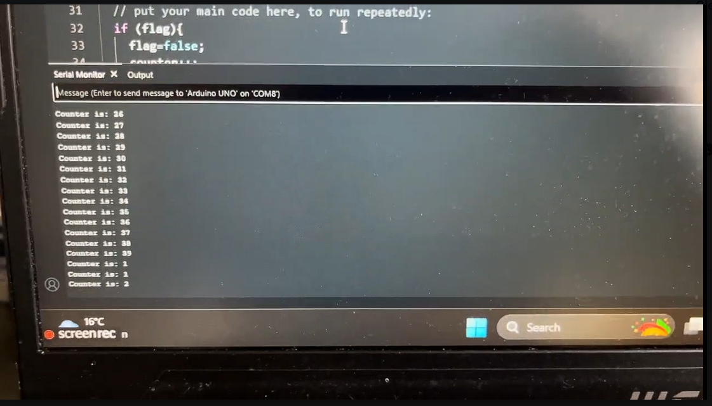

# arduino-interrupts
To count how many times a button is pressed, I added an interrupt in my code. This is simply a void function that runs when the interrupt is triggered to change the state of a variable. The code runs
whenever the interrupt is triggered.

## Video Demonstration

Click the thumbnail below:

